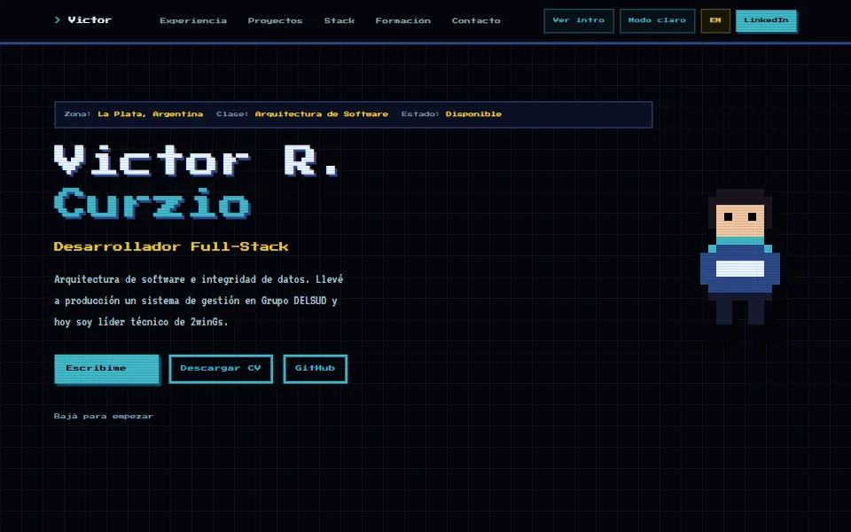

# Portfolio — Victor Roberto Curzio



Sitio personal con el estilo de una consola de 8 bits: experiencia, proyectos,
stack, formación y contacto, en español y en inglés. Es estático, carga rápido y
todo su contenido sale de archivos de datos, igual que los seis CV en PDF que
ofrece para descargar.

**En producción:** <https://viccurzio.github.io/portfolio/> ·
[versión en inglés](https://viccurzio.github.io/portfolio/en/)

## Qué tiene

- **Intro animada** al estilo de la pantalla de presentación de una consola, que
  se puede saltear y no aparece si el sistema pide menos movimiento.
- **Selección de proyectos** como en un juego, con un cuadro de diálogo que
  escribe el resumen letra por letra junto al retrato en pixel art.
- **Dos idiomas y dos temas**, claro y oscuro, con el contraste de texto medido
  en los dos para que se lea bien.
- **CV generados del mismo contenido**: completo, Front-end y Back-end, en
  español e inglés. El sitio y el CV no pueden decir cosas distintas.
- **Imagen para compartir** el link en LinkedIn, WhatsApp y compañía.
- **Carátula en cada proyecto**: la primera pantalla del sistema (inicio o login), que muestra cómo se ve sin exponer datos de nadie.

## Requisitos

| | |
|---|---|
| Node | 22.6 o superior (la misma versión mayor que usa la publicación) |
| Chrome o Edge | para generar los CV y la imagen para compartir |
| Base de datos | no usa |
| Servicios externos | ninguno: no hay variables de entorno |

## Puesta en marcha

```bash
git clone https://github.com/VicCurzio/portfolio.git && cd portfolio
npm install
npm run dev
```

Abre en <http://localhost:3000>. En desarrollo no hay prefijo: el `/portfolio`
lo agrega solo el build, porque es la carpeta bajo la que se publica en GitHub
Pages.

Para ver el resultado tal como sale publicado, hay que servirlo bajo esa misma
carpeta. Si se sirve `out/` en la raíz, la página carga sin estilos ni
JavaScript:

```bash
npm run build                                    # genera el sitio estático en out/
mkdir -p preview && cp -r out preview/portfolio  # lo pone bajo /portfolio
npx serve preview                                # abrir http://localhost:3000/portfolio/
```

## Archivos generados

Tres cosas no se escriben a mano: salen de scripts, se commitean y el build solo
las copia. Si cambia el contenido del que salen, hay que volver a correrlos.

| Comando | Qué genera |
|---|---|
| `npm run cv:all` | Los seis CV en `cv/`. El completo de cada idioma también va a `public/`, que es el que se descarga del sitio |
| `npm run og` | La imagen para compartir, una por idioma (`public/og-es.<hash>.png` y `og-en.<hash>.png`), y `src/content/og-images.json` con sus nombres. El hash cambia con el contenido, así LinkedIn nunca reutiliza una copia vieja |
| `npm run favicon` | `src/app/icon.svg` y `src/app/favicon.ico`, desde el pixel art |

Para un solo CV: `npm run cv -- backend en` (variantes `full`, `frontend`,
`backend`; idiomas `es`, `en`). `og` necesita conexión, porque baja las fuentes.

## Para actualizar el contenido

1. Editá los datos en `src/content/`: `portfolio.ts` (perfil, experiencia,
   formación, habilidades) y `projects.ts` (tarjetas y otros repositorios).
2. Poné la traducción en `portfolio.en.ts` y `projects.en.ts`. Si falta, el
   chequeo de tipos no pasa: un idioma no se puede quedar atrás sin avisar.
3. Para una carátula nueva, guardá la captura de la primera pantalla (inicio o login, 1280 × 800 escalada a 960 × 600, en WebP) en `public/projects/` y referenciala con `image` en el proyecto.
4. Si el cambio toca el CV, ajustá también las variantes de
   `scripts/cv-targets/`, que tienen sus propios textos.
5. Regenerá lo que corresponda (ver arriba) y anotá el cambio en `CHANGELOG.md`,
   bajo "Sin publicar".

## Verificación

No hay suite de tests: la lógica es poca (el cuadro de diálogo, la grilla y el
cambio de idioma) y lo que más puede romperse es el tipado o el build.

```bash
npm run lint       # eslint
npm run typecheck  # tsc --noEmit
```

Los dos corren en GitHub Actions en cada push y en cada pull request, y el
despliegue depende de que pasen: un commit que no compila no se publica.

## Cómo se despliega

Automático. Al pushear a `main`, `.github/workflows/deploy.yml` verifica, compila
el sitio y lo sube a GitHub Pages. No hay paso manual.

Después de cada publicación, `.github/workflows/lighthouse.yml` mide el sitio ya
publicado (rendimiento, accesibilidad, buenas prácticas y SEO) contra el
presupuesto de `.github/lighthouse-budget.json`. Es una medición, no una
barrera: sirve para enterarse si un día empeora, en vez de descubrirlo cuando
alguien avisa que carga lento.

## Decisiones

- **Next.js con salida estática.** El HTML se genera en el build y llega listo:
  carga rápido y el buscador lee el texto sin ejecutar JavaScript, que en una
  carta de presentación importa. Se pierden las partes de Next que necesitan
  servidor, y ninguna hace falta acá.
- **CSS propio con tokens de color, no utilidades de Tailwind.** El estilo de
  8 bits son bordes duros, sombras corridas y pixel art, y se escribe mejor como
  componentes en `src/app/retro.css`. Cada color es un token con un valor por
  tema: un tema nuevo es una lista de valores y nada más.
- **Traducciones como tablas tipadas.** El español es la fuente, y el inglés es
  una tabla indexada por lo que no cambia de idioma (la empresa, el nombre del
  proyecto). Un dato sin traducir no compila.
- **Una sola raíz para los dos idiomas.** Cambiar de idioma no recarga la página.
  El costo es que el `<html>` declara español también en `/en`; lo compensa el
  contenedor de esa página, que declara inglés.
- **Todo lo generado, sin dependencias nuevas.** Los PDF y la imagen los saca
  Chrome sin ventana; el favicon se arma a mano con `zlib`, que viene con Node.
- **Datos estructurados (`schema.org/Person`)** en cada idioma: le dicen al
  buscador que la página es una persona, con su puesto y su lugar.

## Estructura del código

```text
src/
  app/              rutas (/ y /en), estilos, sitemap y robots
  content/          datos y traducciones: el sitio y los CV salen de acá
  components/
    home/           composición de la página
    layout/         documento, barra, idioma y tema
    retro/          intro, selección de proyectos y pixel art
    sections/       inicio, experiencia, proyectos, stack, formación y contacto
scripts/            generadores de CV, imagen para compartir, favicon y release
cv/                 los seis CV generados (HTML y PDF)
public/             CV del sitio, imágenes para compartir y carátulas de proyectos (projects/)
```

## Entrega y versiones

Versiones semánticas, con el historial en `CHANGELOG.md`. Para cerrar una
versión:

```bash
npm run release -- minor --tag   # sube package.json, fecha el CHANGELOG y crea el tag
```

---

**Victor Roberto Curzio** — Desarrollador Full-Stack · La Plata, Argentina ·
[victor.curzio@hotmail.com](mailto:victor.curzio@hotmail.com) ·
[LinkedIn](https://linkedin.com/in/victor-roberto-curzio/)
